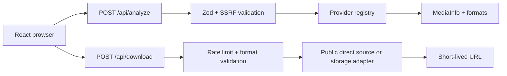

# Dropzone

Dropzone is a serverless-first React/Vite media downloader interface for public media that the user is authorized to save.

## Current provider boundary

The included provider is the `direct` provider. It supports public `.mp4`, `.webm`, `.mov`, `.m4v`, `.mp3`, `.m4a`, `.wav`, and `.ogg` URLs. It performs a safe `HEAD` request, returns source metadata, and sends the browser to the public source URL for download.

YouTube, Pinterest, Instagram, TikTok, and X/Twitter URLs are detected and rejected with a clear provider-not-configured response. This is intentional: adding those providers requires an approved API or extraction service that respects each platform's terms, authentication, robots rules, copyright, and access controls. No DRM, paywall, login, private-account, or region-control bypasses are implemented.

## Run locally

```bash
npm install
npm run dev
```

The Vite frontend expects `/api/analyze` and `/api/download`. For the complete flow, deploy to Vercel or run with a local Vercel adapter such as `vercel dev`.

```bash
npm run build
npm run lint
```

## Deploy to Vercel

1. Import this repository into Vercel.
2. Keep the framework preset as Vite.
3. Configure the variables from `.env.example`.
4. Deploy. Vercel discovers `api/analyze.ts` and `api/download.ts` as serverless functions.

The current direct provider does not need object storage because it never proxies or permanently stores a source file. For extracted or transformed media, add a storage adapter under `api/_lib/storage.ts` using R2, S3, or Vercel Blob, upload to a short-lived object, and return a signed URL with `DOWNLOAD_EXPIRY_SECONDS`. Never use the function filesystem as persistent storage.

## Architecture



The in-browser history stores metadata only in `localStorage`; downloaded files and credentials are never stored there.

## Extending providers

Implement a provider with `canHandle`, `analyze`, `getFormats`, and `download`, then register it after URL validation. Provider implementations must reject private/authenticated content and must enforce timeout, maximum size, and duration limits. Keep platform-specific logic out of the React app.

## Environment variables

- `STORAGE_PROVIDER`, `STORAGE_BUCKET`, `STORAGE_ACCESS_KEY`, `STORAGE_SECRET_KEY`: object-storage adapter settings.
- `RATE_LIMIT_REQUESTS`: analysis requests per minute per best-effort function instance.
- `MAX_FILE_SIZE_MB`: maximum source size accepted by the direct provider.
- `MAX_VIDEO_DURATION_SECONDS`: reserved for extractor-backed providers.
- `DOWNLOAD_EXPIRY_SECONDS`: reserved for signed storage URLs.

The in-memory limiter is intentionally best-effort in serverless deployments. Production traffic should use a durable edge limiter such as Vercel KV, Upstash Redis, or a Cloudflare rate-limit binding.
